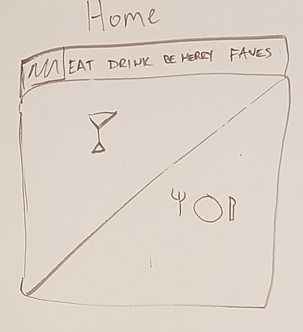
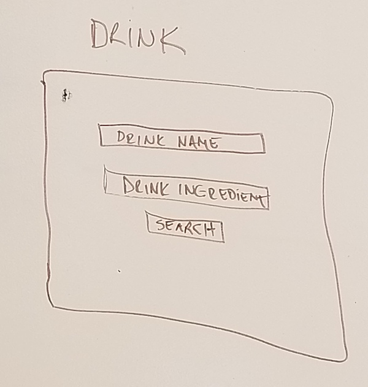
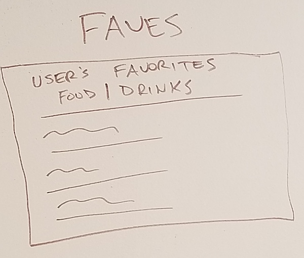

# Project #1: Insatiab.le

#### API
This project will make use of 2 APIs
- [TheCocktailDB](https://www.thecocktaildb.com/api.php)
- [TheMealDB](https://www.themealdb.com/api.php)
  
#### Features
- Homepage will have links to Food, Drink, Random Selections, and Favorites
- Food and Drink pages will have option to search by meal/drink name or ingredient
- Random Selections page will have option to return a random meal or drink
- Favorites will use information stored in localStorage to output a list of user's favorite meals and drinks
  
#### Stretch Goals
-Implement an option to generate a shopping list for a specific meal or drink recipe.
-add contact page with ability for users to send me feedback

#### Wireframes

")

