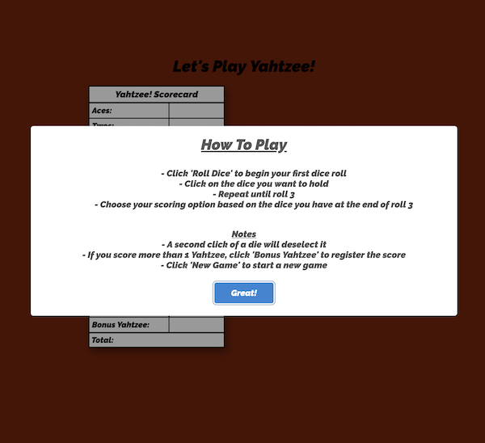

# Project #1: Let's Play Yahtzee!

## Live Link
http://yahtsee.surge.sh/

## API

This project makes use of the DiceAPI

- [DiceAPI](http://roll.diceapi.com/)

## Features

- On page load, app show gamer rules in a modal
- When the game starts, a game board will appear with the scoring options
- Clicking the roll dice button simulates a roll of 5 different six-sided dice
- Player has 3 rolls per turn
- Player can choose which dice to hold or roll

## Technologies

- This app is built with HTML, CSS, and Javascript.
- [SweetAlert2](https://github.com/sweetalert2/sweetalert2) is used to create the modals that contain the game instructions and player score at the end of the game.
- [Animate.css](https://github.com/daneden/animate.css) is used to animate the title, scorecard, and dice boxes.

## Approach
My original app idea (a combined food/cocktail recipe finder), would have required the use of technology that was beyond the scope of this project. Because of this, I decided to build Yahtzee. It is a game I used to play all the time as a child, and a game that I still occasionally play to this day.

## Concept

## Stretch Goals

- Multiple players
- High score saved to local storage
- Option to abandon the rest of your dice rolls for the turn if you choose to hold all 5 dice.

